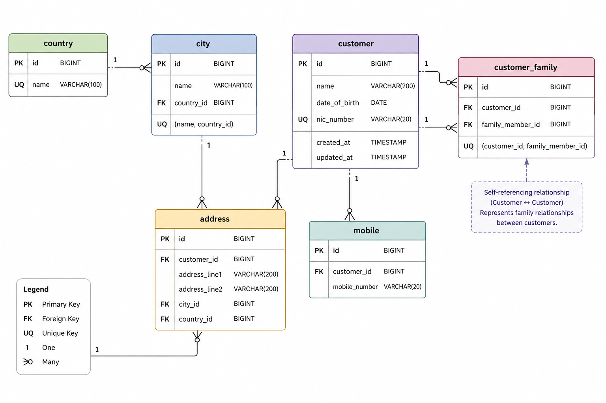

# Customer Management System

A full-stack customer management application with a Spring Boot REST API, a React single-page frontend, and a MariaDB database.

It supports CRUD operations for customers, multiple mobile numbers and addresses, family relationships, and bulk imports from Excel.

## Table of Contents

- [Overview](#overview)
- [Architecture](#architecture)
- [Features](#features)
- [Tech Stack](#tech-stack)
- [Prerequisites](#prerequisites)
- [Ports](#ports)
- [Quick Start (Docker Compose)](#quick-start-docker-compose)
- [Local Development](#local-development)
- [Configuration](#configuration)
- [Database](#database)
- [API](#api)
- [Bulk Upload](#bulk-upload)
- [Testing](#testing)

## Overview

This repository contains:

- `backend/`: Spring Boot 2.7 (Java 8) REST API
- `frontend/`: React (Create React App) UI
- `docker-compose.yml`: Local containerized stack (frontend + backend + MariaDB)

## Architecture

- Frontend is served by Nginx in Docker and proxies `/api` to the backend container.
- Backend exposes REST endpoints under `/api/*` and connects to MariaDB using environment variables.
- Database schema and seed data are initialized via SQL scripts on application startup.

## Features

- Customer create, update, view, delete
- Multiple mobile numbers per customer
- Multiple addresses per customer, linked to city and country master data
- Family member relationships between customers
- Bulk customer import from an Excel file (streamed/chunked processing)

## Tech Stack

- Backend: Java 8, Spring Boot 2.7, Spring Web, Spring Data JPA, Bean Validation
- Database: MariaDB 10.6
- Bulk import: Apache POI + streamed chunk processing
- Frontend: React, React Router, Axios, Bootstrap
- Containerization: Docker, Docker Compose

## Prerequisites

- Docker Desktop (recommended for the quickest setup)
- For local development:
	- JDK 8
	- Node.js 18+ and npm
	- Maven (optional; `backend/` includes `./mvnw`)

## Ports

When running with Docker Compose:

- Frontend: http://localhost:3000
- Backend API: http://localhost:8080
- MariaDB: localhost:3307 (mapped to container port 3306)

## Quick Start (Docker Compose)

From the repository root:

```bash
docker compose up -d --build
```

If your Docker installation uses the legacy Compose CLI, replace `docker compose` with `docker-compose`.

Useful commands:

```bash
docker compose logs -f
docker compose down
```

Notes:

- The database data is persisted in a Docker volume (`db_data`).
- The frontend container uses Nginx and proxies `/api` to the backend container.

## Local Development

### 1) Start MariaDB

If you want to use the provided MariaDB container:

```bash
docker compose up -d db
```

The DB will be available at `localhost:3307`.

### 2) Run the backend

The backend reads DB connection settings from environment variables (with defaults).

From `backend/`:

```bash
cd backend
DB_HOST=localhost \
DB_PORT=3307 \
DB_NAME=customer_management \
DB_USERNAME=springuser \
DB_PASSWORD=springpass \
./mvnw spring-boot:run
```

Backend will start on http://localhost:8080.

### 3) Run the frontend

For local frontend development (React dev server), configure the API base URL to point at the backend:

```bash
cd frontend
npm install
REACT_APP_API_BASE_URL=http://localhost:8080/api npm start
```

Alternatively, create `frontend/.env`:

```env
REACT_APP_API_BASE_URL=http://localhost:8080/api
```

Frontend dev server will start on http://localhost:3000.

## Configuration

### Backend environment variables

The backend supports the following variables (see `backend/src/main/resources/application.properties`):

- `DB_HOST` (default: `localhost`)
- `DB_PORT` (default: `3306`)
- `DB_NAME` (default: `customer_management`)
- `DB_USERNAME` (default: `springuser`)
- `DB_PASSWORD` (default: `springpass`)

File upload limits (configured in Spring):

- Max file size: `200MB`
- Max request size: `200MB`

### Frontend environment variables

- `REACT_APP_API_BASE_URL` (default: `/api`)

## Database

The backend initializes the schema and seed data using these scripts on startup:

- `backend/src/main/resources/schema.sql`
- `backend/src/main/resources/data.sql`

Reference copies are also available under `docs/`:

- `docs/schema.sql`
- `docs/data.sql`

Entity relationships are documented here:



## API

Base URL: `http://localhost:8080/api`

### Customers

| Method | Endpoint | Description |
|---|---|---|
| `GET` | `/customers` | Paginated list of customers (`page`, `size`, `sortBy`, `direction`) |
| `GET` | `/customers/{id}` | Get customer by ID |
| `GET` | `/customers/nic/{nic}` | Get customer by NIC |
| `POST` | `/customers` | Create customer |
| `PUT` | `/customers/{id}` | Update customer |
| `DELETE` | `/customers/{id}` | Delete customer |
| `POST` | `/customers/{customerId}/mobiles` | Add a mobile number |
| `POST` | `/customers/{customerId}/addresses` | Add an address |
| `POST` | `/customers/{customerId}/family/{familyMemberId}` | Link a family member |
| `POST` | `/customers/bulk` | Bulk import from Excel |

### Master data

| Method | Endpoint | Description |
|---|---|---|
| `GET` | `/countries` | List countries |
| `GET` | `/countries/{id}` | Get country by ID |
| `GET` | `/countries/map` | Country name-to-entity map |
| `GET` | `/cities` | List cities |
| `GET` | `/cities/{id}` | Get city by ID |
| `GET` | `/cities/by-country/{countryId}` | Cities for a country |
| `GET` | `/cities/by-country-name?countryName=...` | Cities for a country name |

## Bulk Upload

Endpoint: `POST /api/customers/bulk` with multipart form field `file`.

Accepted file type: `.xlsx` (Excel OpenXML).

Expected columns (in order):

1. Name
2. Date of Birth (format: `yyyy-MM-dd`)
3. NIC Number

Behavior notes:

- NIC is unique in the database.
- The bulk import uses an upsert strategy (existing NICs are updated).
- The API returns `successCount`, `errorCount`, and up to 100 error messages.

## Testing

Backend tests:

```bash
cd backend
./mvnw clean test
```

Frontend tests:

```bash
cd frontend
npm test
```
